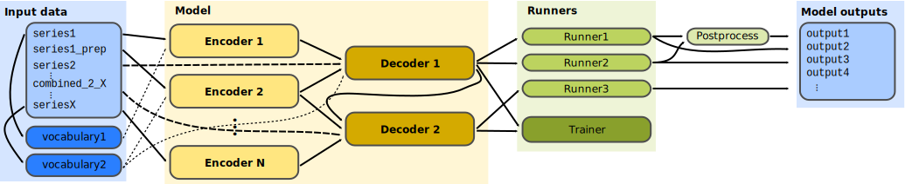

.. _overview:

================
Package Overview
================

This overview should provide you with the basic insight on how Neural Monkey
conceptualizes the problem of sequence-to-sequence learning how the data flow
during training and look like.

-------------------------------
Loading and Processing Datasets
-------------------------------

We call a *dataset* a collection of named data *series*. By a series we a mean
a sequence of data items of the same type representing one type of input or
desired output of a model. In the simple case of machine translation, there are
two series: a sequence of source-language sentences and a sequence of
target-language sequences.

The following scheme captures how a dataset is created from input
data.

.. image:: dataset_creation.svg

The dataset is created in the following steps:

- An input file is read using a *reader*. Reader can e.g., load a file
  containing paths to JPEG images and load them as ``numpy`` arrays, or just
  read a tokenized text as a list of lists (sentences) of string tokens.

- Series created by the readers can be pre-processed by some *series-level
  pre-processors*. An example of such pre-processing is byte-pair encoding
  which loads a list of merges and re-tokenizes the text accordingly.

- The final step before creating a dataset is applying *dataset-level*
  preprocessors which can take more series and output a new series.

Currently there are two implementations of a dataset. An in-memory dataset
which stores all data in the memory and a lazy dataset which reads
the input files step by step and only the batches necessary for the computation
are stored
in the memory.

----------------------------
Training and Running a Model
----------------------------

This section describes the training and running workflow. The main concepts and
their interconnection can be seen in the following scheme.

The dataset series can be used to create a *vocabulary*. A vocabulary
represents an indexed set of tokens and provides functionality for converting
lists of tokenized sentences into matrices of token indices and vice
versa. Vocabularies are used by encoders and decoders for feeding the provided
series into the neural network.

The model itself is defined by *encoders* and *decoders*. Most of the
TensorFlow code is in the encoders and decoders. Encoders are parts of the
model which take some input and compute a representation of it. Decoders are
model parts that produce some outputs. Our definition of encoders and decoders
is more general than in the classical sequence-to-sequence learning. An encoder
can be also a convolutional network processing an image. The RNN decoder is for
us only a special type of decoder, it can be also a sequence labeler or a
simple multilayer-perceptron classifier.

Decoders can be executed using so called *runners*. Different runners represent
different ways of running the model. We might want to get a single best
estimation, get an ``n``-best list or sample from the model. We might want to
use an RNN decoder to get the decoded sequences or we might be interested in
the word alignment obtained by its attention model. This is all done by
employing different runners over the decoders. The outputs of the runners can
be subject of further *post-processing*.

A *trainer* is a special case of a runner, the only one that actually modifies
the model. It collects the objective functions and uses them in an optimizer.

All of this is managed by a *TensorFlow manager*. Its basic capability is to
execute runners on provided datasets.
